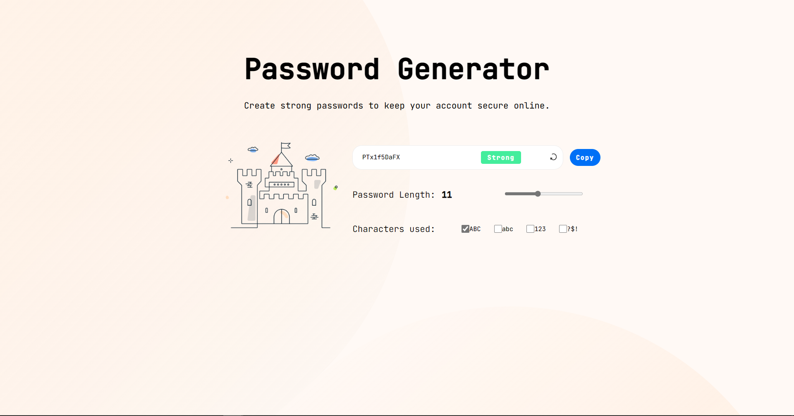

# Avast password generator clone

This is a clone of [Avast random password generator](https://www.avast.com/random-password-generator#pc)

Live Site URL: [Github Pages](https://ltossian.github.io/password-generator/)

## Table of contents

- [Overview](#overview)
    - [The challenge](#the-challenge)
    - [Screenshot](#screenshot)
- [My process](#my-process)
    - [Built with](#built-with)
    - [What I learned](#what-i-learned)
    - [Continued development](#continued-development)
- [Author](#author)

## Overview

### The challenge

Users should be able to:
 
- View the optimal layout for the app depending on their device's screen size
- Apply settings to the password they want
- Copy their generated password
- See strength badges and images updates

### Screenshot

## My Process

### Built with

- HTML5
- CSS
- TypeScript
- Vite

### What I Learned

My goal during this project was to get a hang of typescript's syntax and OOP philosophy more than anything. 

### Continued development

Now that I am fairly comfortable on typescript, I'm looking forward to building a Single Page Application using a framework.
Regarding this project, there is still some styling undone, such as the input range and the checkboxes as well as the crypting effect that you  can notice on the original application.

## Author

- Twitter - [@louisantch](https://www.twitter.com/louisantch)
- Frontend Mentor - [@ltossian](https://www.frontendmentor.io/profile/ltossian)
- Avast Design - [Avast Random Password](https://www.avast.com/random-password-generator#pc)